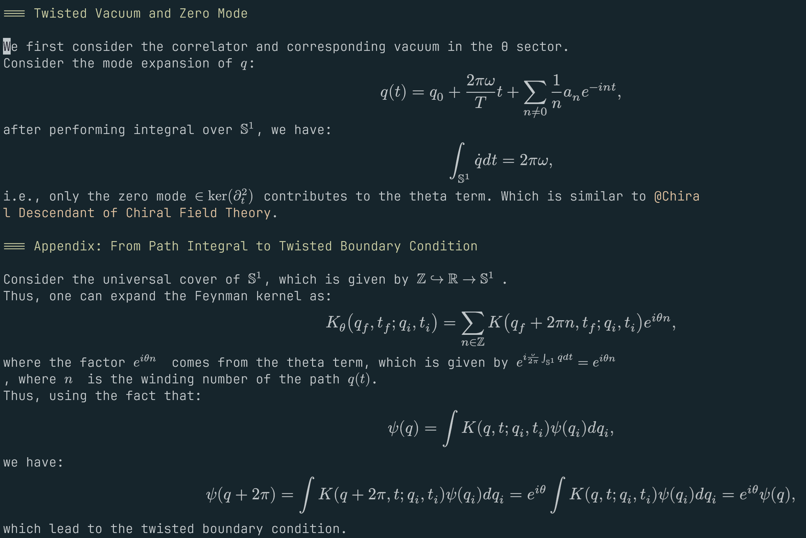
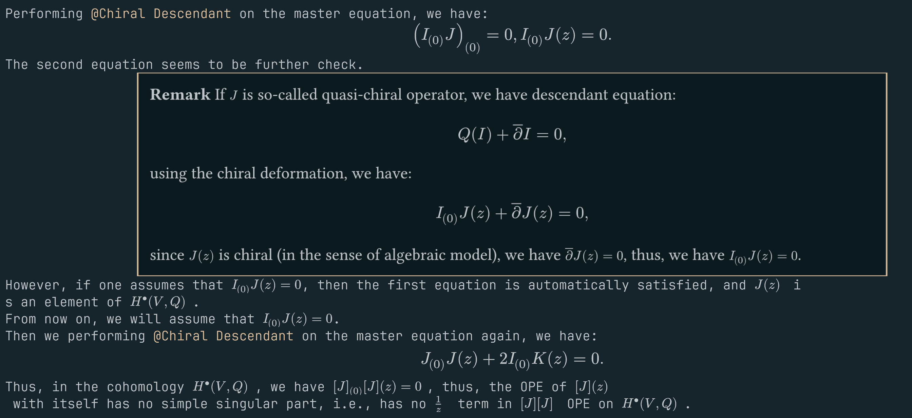
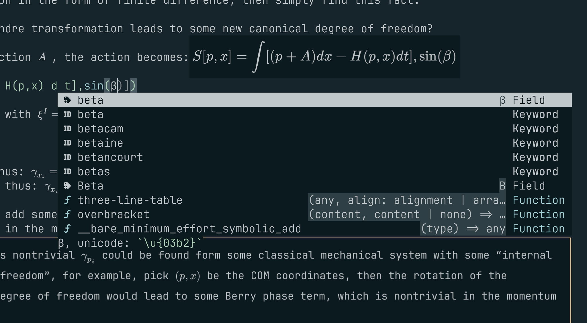

# Typst concealer

A neovim plugin that uses the new(ish) kitty unicode rendering protocol to render typst expressions inline.
Has live previews as you type in insert mode.

Requires nvim >=11.0, and only works properly in ghostty and kitty.

Works in tmux (partially, it will break if two instances of the plugin work as they will replace each-other's images), will not work in zellij as they have no way of passing through the escape sequences kitty needs to display images.

Forked from [typst-concealer](https://www.github.com/PartyWumpus/typst-concealer), with love and efforts (both from me and gpt5.4, claude sonnet 4.6 etc.)







## Installation
Lazy.nvim:
```lua
return {
  "pxwg/typst-concealer",
  opts = {},
  ft = "typst",
}
```

### Keybinds
Typst-concealer can be disabled/enabled inside buffers. You can change the default with the `enabled_by_default` option.
```lua
-- example keybinds
vim.keymap.set("n", "<leader>ts", function()
  require("typst-concealer").enable_buf(vim.fn.bufnr())
end)
vim.keymap.set("n", "<leader>th", function()
  require("typst-concealer").disable_buf(vim.fn.bufnr())
end)
```

## Features
- (Maybe) highest resolution typst rendering in neovim community.
- More configurations aimed for multiple files projects.
- Live previews when in insert mode with float window
- Supports top level set/let/import
- Renders code blocks
- Renders math blocks
- Can automatically match your nvim colorscheme

## Options
The options are mostly explained in the types, so either take a look in the code, (look for the `typstconfig` type) or get a good lua LSP and take a look what your autocomplete tells you.
The `styling_type` option is probably the most important one. It has three modes:
- "colorscheme" (default): Transparent background, and match the text color to your nvim colorscheme's color. This works reasonably well for most builtins, but many libraries aren't themed properly, or just look downright weird.
- "simple": Just remove the padding and get the width/height to fit of things to fit properly. Will have a white background, looking a little out of place in dark themes, but may be acceptable.
- "none": Do nothing, and completely rely on the user provided `#set`s. This is best for documents that never intend to be actually rendered as pdf/html, but just in neovim, otherwise the output of either neovim or the pdf is going to look rather strange.

These styles are applied *after* all other rules are applied.

For multi-file projects, `render_paths` can be used to bypass expensive files by path pattern. The table shape is intentionally simple Neovim config:

```lua
require("typst-concealer").setup({
  render_paths = {
    -- Optional whitelist: when non-empty, only these paths render.
    include = {
      "/notes/",
      "/slides/",
      function(path)
        return path:match("/chapters/[^/]+%.typ$") ~= nil
      end,
    },
    -- Blacklist always wins over include.
    exclude = {
      "/vendor/",
      "/node_modules/",
      "/%.git/",
      "/large%-generated/",
      "template%-cache%.typ$",
    },
  },
})
```

String rules use Lua patterns matched against the normalized absolute file path. Function rules receive `(path, bufnr)` and should return `true` when the buffer should match that rule.

Live preview is enabled by default. If you want only the static concealed render and no cursor-following preview, disable it explicitly:

```lua
require("typst-concealer").setup({
  live_preview_enabled = false,
})
```

For multi-file projects that rely on rooted Typst paths like `#image("/assets/figure.png")`, configure `get_root` so concealer can preserve the same project-root semantics as your real build:

```lua
require("typst-concealer").setup({
  get_root = function(_bufnr, path, _cwd, _kind)
    local wiki_root = vim.fs.normalize(vim.fn.expand("~/wiki"))
    local normalized = vim.fs.normalize(path)
    if normalized == wiki_root or normalized:sub(1, #wiki_root + 1) == wiki_root .. "/" then
      return wiki_root
    end
  end,
})
```

`get_root(bufnr, path, cwd, kind)` should return the source/project root as an absolute filesystem path. When omitted or when it returns `nil`, concealer falls back to the nearest directory containing `typst.toml`, and then to the current buffer directory.

`compiler_args` is still passed through to Typst, but `--root` inside `compiler_args` is ignored because concealer computes the watch root itself.

Two other project hooks are available:

```lua
require("typst-concealer").setup({
  get_inputs = function(_bufnr, _path, _cwd, _kind)
    return { "concealed=true" }
  end,
  get_preamble_file = function(_bufnr, path, _cwd, _kind)
    local wiki_root = vim.fs.normalize(vim.fn.expand("~/wiki"))
    if vim.fs.normalize(path):find(wiki_root, 1, true) == 1 then
      return wiki_root .. "/concealer-context.typ"
    end
  end,
})
```

- `get_inputs` appends extra `--input key=value` pairs to `typst watch`.
- `get_preamble_file` injects a project-level `.typ` file at the top of the generated batch document.

## Known issues
- A temporary watch workspace is created under `<project-root>/.typst-concealer/` and used for `typst watch`. Keeping it inside the project root preserves rooted Typst path semantics for imported project files. The plugin removes active session files when disabled, but the directory may remain after crashes and is safe to delete.
- Breaks sometimes, pls report if any errors happen
- Sometimes the message sent to the kitty image protocol gets displayed on the screen as colourful garbage text. It's difficult to reproduce, and I have no idea what to do about this.

## Helpful tips

Sometimes, while rendering typst with some `#show` rules, for example:
```typ
#show conf.with(name: "test")
```
this plugin would crash since it breaks the preamble injection from the plugin. To fix this, you can do this hacky way to avoid this crash:
```typ
#let conf(name: "Title", doc) = {
  if concealed == "true" {
    doc
  } else {
    // place your actual theme/conf here
  }
}
```
and passing the `concealed` variable to `typst` in the configuration of the plugin:
```lua
require("typst-concealer").setup({
  -- other options...
  compiler_args = {
    "--input",
    "concealed=true",
  },
})
```
Then the crash should be avoided, and you can still have your actual theme/conf when you render the pdf/html.

## TODO
- [ ] Investigate weird rendering bug with transparency
- [ ] Write some better documentation. Investigate what the best way of doing it is.
